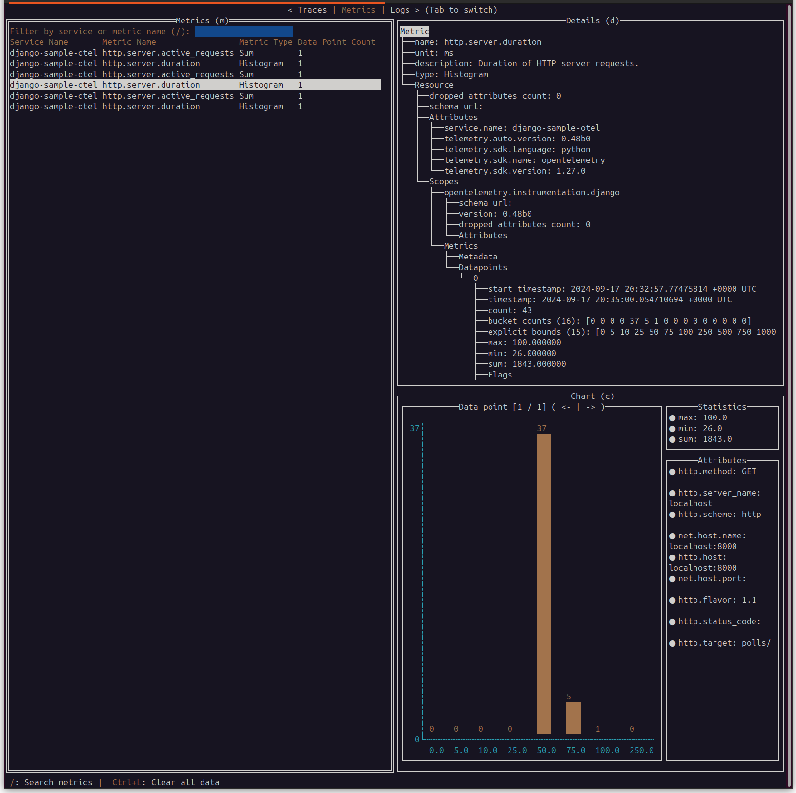
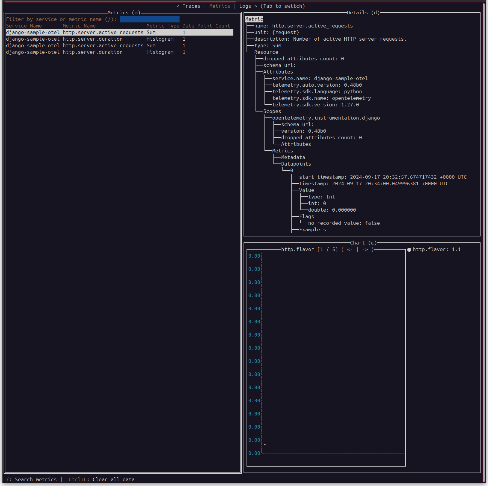
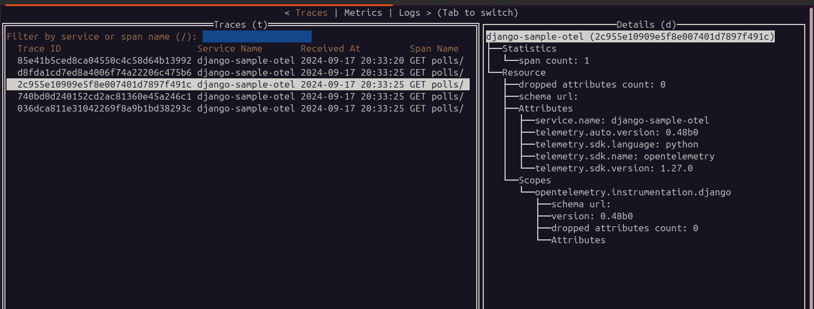

run otel-tui
```shell
docker run --rm -it --name otel-tui -p 4317:4317 -p 4318:4318 ymtdzzz/otel-tui:latest
```

run django with auto-instrumentation
```shell
bash run.sh
```

send some requests to http://localhost:8080/polls

check that traces and metrics are being sent to otel-tui




